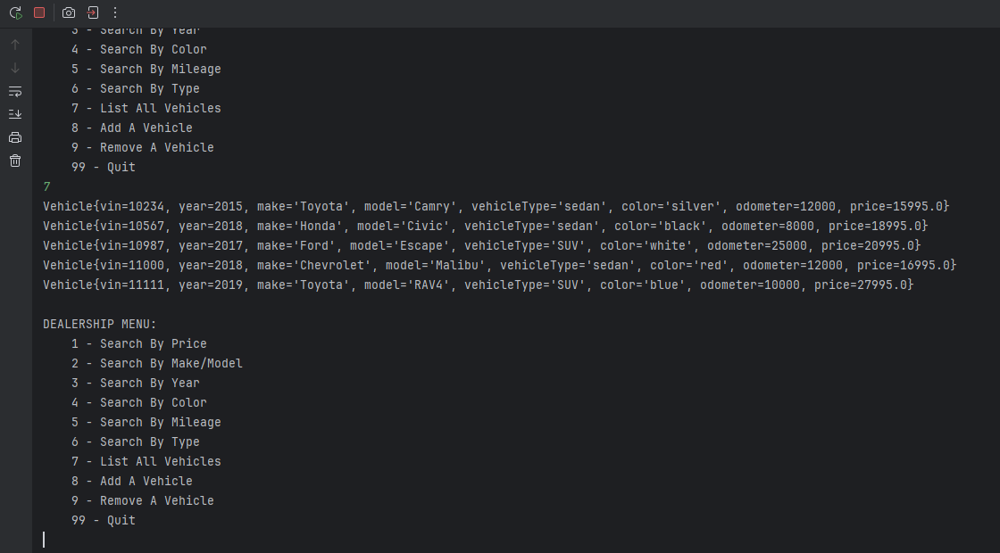
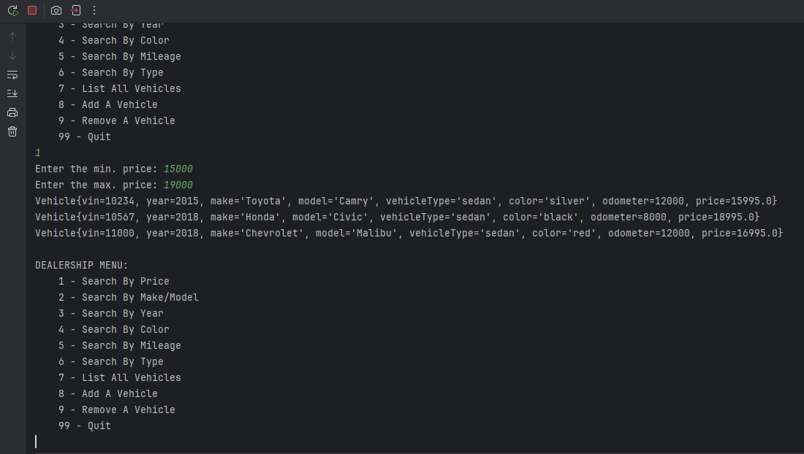
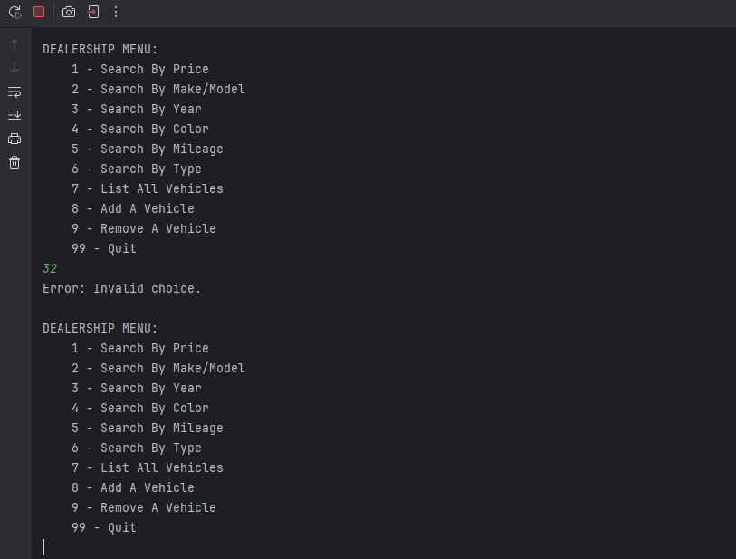

# Car Dealership

## Description of the Project

The Car Dealership application allows users to explore a filtering system, which takes information parsed from a .csv file, and prints out lists of cars in a clean format. Users can also add a new car to the file, or remove a car from the file.

## User Stories

- As a user, I want to Search for cars under different filter criteria, so that I can find the specific car I want.
- As a developer, I want to have the main code read from and write to a file, so that I can add or remove cars from a running tab.
- As a user, I want to be able to navigate the menus in a clean and friendly way, so that I can have a good user experience.
- As a user, I want to have the presentation of the program to be pretty AND functional, so I can easily understand what I'm looking at.

## Setup

Instructions on how to set up and run the project using IntelliJ IDEA.

### Prerequisites

- IntelliJ IDEA: Ensure you have IntelliJ IDEA installed, which you can download from [here](https://www.jetbrains.com/idea/download/).
- Java SDK: Make sure Java SDK is installed and configured in IntelliJ.

### Running the Application in IntelliJ

Follow these steps to get your application running within IntelliJ IDEA:

1. Open IntelliJ IDEA.
2. Select "Open" and navigate to the directory where you cloned or downloaded the project.
3. After the project opens, wait for IntelliJ to index the files and set up the project.
4. Find the main class with the `public static void main(String[] args)` method.
5. Right-click on the file and select 'Run 'CarDealership.main()'' to start the application.

## Technologies Used

- Java: JDK 17
- java.util.ArrayList;
- java.util.List;
- java.util.Scanner;
- java.io.BufferedReader;
- java.io.BufferedWriter;
- java.io.FileReader;
- java.io.FileWriter;

## Demo

**Show All Vehicles:**

**Filter Vehicles by Price Range:**

**Error Handling:**

## Future Work

Future work that I may decide to add:

- Whatever Raymond decides.

## Resources

- Stack Overflow
- w3schools

## Thanks

- Thank you to [**Raymond**] for continuous support and guidance.
- **Carmen**, **Corrie**, and **Joseph** for helping me fix my code so I didn't lose my entire mind.